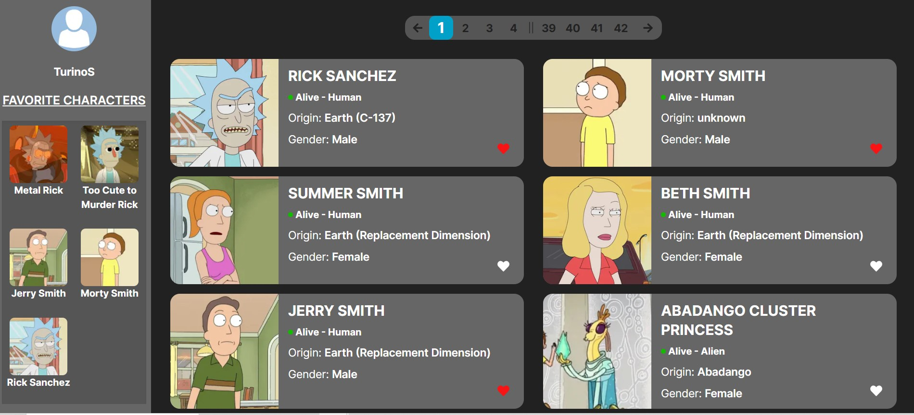

# Rick n Morty

## Projeto realizado com o intuito de praticar a implementação de testes unitários.



### Você pode ver o projeto em funcionamento [AQUI](https://rick-n-morty-git-main-turinos.vercel.app/)

### 🎯 Proposta:

&nbsp;&nbsp;&nbsp;&nbsp;&nbsp;&nbsp;&nbsp;&nbsp;Primeiro projeto em que usei Jest e React Testing Library para realizar testes e garantir a qualidade do meu código. Além disso pratiquei o uso do Next.js com TypeScript e Tailwind CSS para aprimorar a apresentação de um site com uma interface amigável e intuitiva para o usuário.
&nbsp;&nbsp;&nbsp;&nbsp;&nbsp;&nbsp;&nbsp;&nbsp;Trata-se de uma página que se utiliza da The Rick and Morty API para fornecer ao usuário uma lista dos personagens da série onde o usuário pode favoritar os personagens para facilitar suas buscas futuras.

### 🛠 Tecnologias utilizadas:

- Next.js
- TypeScript
- Tailwind CSS
- Jest
- React Testing Library
- Context API

### ☑️ Para rodar você precisará:

- Editor de código de sua preferência (recomendado VS Code)
- Git
- Gerenciador de pacotes Yarn ou NPM

### 📝 Procedimentos de instalação

Clone este repositório usando o comando:

```
https://github.com/TurinoS/Rick-n-Morty.git
```

Na pasta do projeto instale as dependências com uso do npm ou yarn

```
npm install

ou

yarn install
```

Inicie o projeto com

```
npm run dev

ou

yarn dev
```

### 😎 Minhas redes

- Linkedin - [paulo-turino](https://www.linkedin.com/in/paulo-turino/)
- GitHub - [TurinoS](https://github.com/TurinoS)
- Instagram - [@paulo_turino](https://www.instagram.com/paulo_turino/)
